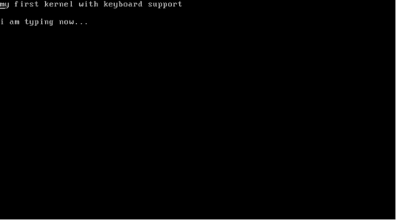

# Kernel 101
> Write a kernel in C

------

## Theory

Hello World,

Let us write a simple kernel which could be loaded with the GRUB bootloader on an x86 system. This kernel will display a message on the screen and then hang.


### How does an x86 machine boot

Before we think about writing a kernel, let’s see how the machine boots up and transfers control to the kernel:

Most registers of the x86 CPU have well defined values after power-on. The Instruction Pointer (EIP) register holds the memory address for the instruction being executed by the processor. EIP is hardcoded to the value **0xFFFFFFF0**. Thus, the x86 CPU is hardwired to begin execution at the physical address 0xFFFFFFF0. It is in fact, the last 16 bytes of the 32-bit address space. This memory address is called reset vector.

Now, the chipset’s memory map makes sure that 0xFFFFFFF0 is mapped to a certain part of the BIOS, not to the RAM. Meanwhile, the BIOS copies itself to the RAM for faster access. This is called **shadowing**. The address 0xFFFFFFF0 will contain just a jump instruction to the address in memory where BIOS has copied itself.

Thus, the BIOS code starts its execution.  BIOS first searches for a bootable device in the configured boot device order. It checks for a certain magic number to determine if the device is bootable or not. (whether bytes 511 and 512 of first sector are **0xAA55**)

Once the BIOS has found a bootable device, it copies the contents of the device’s first sector into RAM starting from physical address **0x7c00**; and then jumps into the address and executes the code just loaded. This code is called the **bootloader**.

The bootloader then loads the kernel at the physical address **0x100000**. The address 0x100000 is used as the start-address for all big kernels on x86 machines.

All x86 processors begin in a simplistic 16-bit mode called **real mode**. The GRUB bootloader makes the switch to 32-bit **protected mode** by setting the lowest bit of `CR0` register to **1**. Thus the kernel loads in 32-bit protected mode.

Do note that in case of linux kernel, GRUB detects linux boot protocol and loads linux kernel in real mode. Linux kernel itself [makes the switch](https://github.com/torvalds/linux/blob/949163015ce6fdb76a5e846a3582d3c40c23c001/arch/x86/boot/main.c#L181) to protected mode.

### What all do we need?

* An x86 computer (of course)  
* Linux  
* [NASM assembler](https://www.nasm.us/)  
* gcc  
* ld (GNU Linker)  
* grub

#### Source Code

Source code is available at my [Github repository - mkernel](https://github.com/arjun024/mkernel)


### The entry point using assembly

We like to write everything in C, but we cannot avoid a little bit of assembly. We will write a small file in x86 assembly-language that serves as the starting point for our kernel. All our assembly file will do is invoke an external function which we will write in C, and then halt the program flow.

How do we make sure that this assembly code will serve as the starting point of the kernel?

We will use a linker script that links the object files to produce the final kernel executable. (more explained later)  In this linker script, we will explicitly specify that we want our binary to be loaded at the address 0x100000. This address, as I have said earlier, is where the kernel is expected to be. Thus, the bootloader will take care of firing the kernel’s entry point.

Here’s the assembly code:

```nasm
;;kernel.asm
bits 32			;nasm directive - 32 bit
section .text

global start
extern kmain	        ;kmain is defined in the c file

start:
  cli 			;block interrupts
  mov esp, stack_space	;set stack pointer
  call kmain
  hlt		 	;halt the CPU

section .bss
resb 8192		;8KB for stack
stack_space:
```

The first instruction `bits 32` is not an x86 assembly instruction. It’s a directive to the NASM assembler that specifies it should generate code to run on a processor operating in 32 bit mode. It is not mandatorily required in our example, however is included here as it’s good practice to be explicit.

The second line begins the text section (aka code section). This is where we put all our code.

`global` is another NASM directive to set symbols from source code as global. By doing so, the linker knows where the symbol `start` is; which happens to be our entry point.

`kmain` is our function that will be defined in our `kernel.c` file. `extern` declares that the function is declared elsewhere.

Then, we have the `start` function, which calls the `kmain` function and halts the CPU using the `hlt` instruction. Interrupts can awake the CPU from an `hlt` instruction. So we disable interrupts beforehand using `cli` instruction. `cli` is short for clear-interrupts.

We should ideally set aside some memory for the stack and point the stack pointer (`esp`) to it. However, it seems like GRUB does this for us and the stack pointer is already set at this point. But, just to be sure, we will allocate some space in the BSS section and point the stack pointer to the beginning of the allocated memory. We use the `resb` instruction which reserves memory given in bytes. After it, a label is left which will point to the edge of the reserved piece of memory. Just before the `kmain` is called, the stack pointer (`esp`) is made to point to this space using the `mov` instruction.

## The kernel in C

In `kernel.asm`, we made a call to the function `kmain()`. So our C code will start executing at `kmain()`:

```c
/*
*  kernel.c
*/
void kmain(void)
{
	const char *str = "my first kernel";
	char *vidptr = (char*)0xb8000; 	//video mem begins here.
	unsigned int i = 0;
	unsigned int j = 0;

	/* this loops clears the screen
	* there are 25 lines each of 80 columns; each element takes 2 bytes */
	while(j < 80 * 25 * 2) {
		/* blank character */
		vidptr[j] = ' ';
		/* attribute-byte - light grey on black screen */
		vidptr[j+1] = 0x07; 		
		j = j + 2;
	}

	j = 0;

	/* this loop writes the string to video memory */
	while(str[j] != '\0') {
		/* the character's ascii */
		vidptr[i] = str[j];
		/* attribute-byte: give character black bg and light grey fg */
		vidptr[i+1] = 0x07;
		++j;
		i = i + 2;
	}
	return;
}
```


All our kernel will do is clear the screen and write to it the string “my first kernel”.

First we make a pointer `vidptr` that points to the address **0xb8000**. This address is the start of video memory in protected mode. The screen’s text memory is simply a chunk of memory in our address space. The memory mapped input/output for the screen starts at 0xb8000 and supports 25 lines, each line contain 80 ascii characters.

Each character element in this text memory is represented by 16 bits (2 bytes), rather than 8 bits (1 byte) which we are used to.  The first byte should have the representation of the character as in ASCII. The second byte is the `attribute-byte`. This describes the formatting of the character including attributes such as color.

To print the character `s` in green color on black background, we will store the character `s` in the first byte of the video memory address and the value 0x02 in the second byte.  
`0` represents black background and `2` represents green foreground.

  
Have a look at table below for different colors:

<table align='center'>
	<tr>
		<th>Code</th>
		<th>Color</th>
	</tr>
	<tr>
		<td>1</td>
		<td>Blue</td>
	</tr>
	<tr>
		<td>2</td>
		<td>Green</td>
	</tr>
	<tr>
		<td>3</td>
		<td>Cyan</td>
	</tr>
	<tr>
		<td>4</td>
		<td>Red</td>
	</tr>
	<tr>
		<td>5</td>
		<td>Magenta</td>
	</tr>
	<tr>
		<td>6</td>
		<td>Brown</td>
	</tr>
	<tr>
		<td>7</td>
		<td>Light Grey</td>
	</tr>
	<tr>
		<td>8</td>
		<td>Dark Grey</td>
	</tr>
	<tr>
		<td>9</td>
		<td>Light Blue</td>
	</tr>
	<tr>
		<td>10/a</td>
		<td>Light Green</td>
	</tr>
	<tr>
		<td>11/b</td>
		<td>Light Cyan</td>
	</tr>
	<tr>
		<td>12/c</td>
		<td>Light Red</td>
	</tr>
	<tr>
		<td>13/d</td>
		<td>Light Magenta</td>
	</tr>
	<tr>
		<td>14/e</td>
		<td>Light Brown</td>
	</tr>
	<tr>
		<td>15</td>
		<td>White</td>
	</tr>
</table>

```
0 - Black,
1 - Blue,
2 - Green,
3 - Cyan,
4 - Red,
5 - Magenta,
6 - Brown,
7 - Light Grey,
8 - Dark Grey,
9 - Light Blue,
10/a - Light Green,
11/b - Light Cyan,
12/c - Light Red,
13/d - Light Magenta,
14/e - Light Brown,
15/f – White.
```


In our kernel, we will use light grey character on a black background. So our attribute-byte must have the value 0x07.

In the first while loop, the program writes the blank character with 0x07 attribute all over the 80 columns of the 25 lines. This thus clears the screen.

In the second while loop, characters of the null terminated string “my first kernel” are written to the chunk of video memory with each character holding an attribute-byte of 0x07.

This should display the string on the screen.

### The linking part

We will assemble `kernel.asm` with NASM to an object file; and then using GCC we will compile `kernel.c` to another object file. Now, our job is to get these objects linked to an executable bootable kernel.  
  
For that, we use an explicit linker script, which can be passed as an argument to `ld` (our linker).

```nasm
/*
*  link.ld
*/
OUTPUT_FORMAT(elf32-i386)
ENTRY(start)
SECTIONS
 {
   . = 0x100000;
   .text : { *(.text) }
   .data : { *(.data) }
   .bss  : { *(.bss)  }
 }
```


First, we set the **output format** of our output executable to be 32 bit [Executable and Linkable Format](https://elinux.org/Executable_and_Linkable_Format_(ELF)) (ELF). ELF is the standard binary file format for Unix-like systems on x86 architecture.

**ENTRY** takes one argument. It specifies the symbol name that should be the entry point of our executable.

**SECTIONS** is the most important part for us. Here, we define the layout of our executable. We could specify how the different sections are to be merged and at what location each of these is to be placed.

Within the braces that follow the SECTIONS statement, the period character (.) represents the **location counter**.  
The location counter is always initialized to 0x0 at beginning of the SECTIONS block. It can be modified by assigning a new value to it.

Remember, earlier I told you that kernel’s code should start at the address 0x100000. So, we set the location counter to 0x100000.

Have look at the next line `.text : { *(.text) }`

The asterisk (`*`) is a wildcard character that matches any file name. The expression `*(.text)` thus means all `.text` input sections from all input files.  
  
So, the linker merges all text sections of the object files to the executable’s text section, at the address stored in the location counter. Thus, the code section of our executable begins at 0x100000.

After the linker places the text output section, the value of the location counter will become  
0x1000000 + the size of the text output section.

Similarly, the data and bss sections are merged and placed at the then values of location-counter.

### Grub and Multiboot

Now, we have all our files ready to build the kernel. But, since we like to boot our kernel with the [GRUB bootloader](https://www.gnu.org/software/grub/), there is one step left.

There is a standard for loading various x86 kernels using a boot loader; called as **Multiboot specification**.

GRUB will only load our kernel if it complies with the [Multiboot spec](https://www.gnu.org/software/grub/manual/multiboot/multiboot.html).

According to the spec, the kernel must contain a header (known as Multiboot header) within its first 8 KiloBytes.

Further, This Multiboot header must contain 3 fields that are 4 byte aligned namely:

-   a **magic** field: containing the magic number **0x1BADB002**, to identify the header.
-   a **flags** field: We will not care about this field. We will simply set it to zero.
-   a **checksum** field: the checksum field when added to the fields ‘magic’ and ‘flags’ must give zero.

So our `kernel.asm` will become:

```nasm
;;kernel.asm

;nasm directive - 32 bit
bits 32
section .text
        ;multiboot spec
        align 4
        dd 0x1BADB002            ;magic
        dd 0x00                  ;flags
        dd - (0x1BADB002 + 0x00) ;checksum. m+f+c should be zero

global start
extern kmain	        ;kmain is defined in the c file

start:
  cli 			;block interrupts
  mov esp, stack_space	;set stack pointer
  call kmain
  hlt		 	;halt the CPU

section .bss
resb 8192		;8KB for stack
stack_space:
```


The **dd** defines a double word of size 4 bytes.  
  

### Building the kernel

We will now create object files from `kernel.asm` and `kernel.c` and then link it using our linker script.

```bash
nasm -f elf32 kernel.asm -o kasm.o
```


will run the assembler to create the object file kasm.o in ELF-32 bit format.

```bash
gcc -m32 -c kernel.c -o kc.o
```


The ’`-c` ’ option makes sure that after compiling, linking doesn’t implicitly happen.

```bash
ld -m elf_i386 -T link.ld -o kernel kasm.o kc.o
```

will run the linker with our linker script and generate the executable named **kernel**.

### Configure your grub and run your kernel

GRUB requires your kernel to be of the name pattern `kernel-<version>`. So, rename the kernel. I renamed my kernel executable to kernel-701.

Now place it in the **/boot** directory. You will require superuser privileges to do so.

In your GRUB configuration file `grub.cfg` you should add an entry, something like:

```cfg
title myKernel
	root (hd0,0)
	kernel /boot/kernel-701 ro
```

Don’t forget to remove the directive `hiddenmenu` if it exists.

Reboot your computer, and you’ll get a list selection with the name of your kernel listed.

Select it and you should see:


That’s your kernel!!


**PS**:

* It’s always advisable to get yourself a virtual machine for all kinds of kernel hacking. * To run this on **grub2** which is the default bootloader for newer distros, your config should look like this:

```cfg
menuentry 'kernel 701' {
	set root='hd0,msdos1'
	multiboot /boot/kernel-701 ro
}
```

* Also, if you want to run the kernel on the `qemu` emulator instead of booting with GRUB, you can do so by:

```bash
qemu-system-i386 -kernel kernel
```

-----

# Kernel 201

## Enhancing the Kernel 101
In my previous article [Kernels 101 - Let’s write a Kernel](https://arjunsreedharan.org/post/82710718100/kernels-101-lets-write-a-kernel),   
I wrote how we can build a rudimentary x86 kernel that boots up using GRUB,  
runs in protected mode and prints a string on the screen.

Today, we will extend that kernel to include keyboard driver that can read the characters a-z and 0-9 from the keyboard and print them on screen.

Source code used for this article is available at my [Github repository - mkeykernel](https://github.com/arjun024/mkeykernel)


We communicate with I/O devices using **I/O ports**. These ports are just specific address on the x86’s I/O bus, nothing more. The read/write operations from these ports are accomplished using specific instructions built into the processor.

### Reading from and Writing to ports

```nasm
read_port:
	mov edx, [esp + 4]
	in al, dx	
	ret

write_port:
	mov   edx, [esp + 4]    
	mov   al, [esp + 4 + 4]  
	out   dx, al  
	ret
```

I/O ports are accessed using the `in` and `out` instructions that are part of the x86 instruction set.

In `read_port`, the port number is taken as argument. When compiler calls your function, it pushes all its arguments onto the stack. The argument is copied to the register `edx` using the stack pointer. The register `dx` is the lower 16 bits of `edx`. The `in` instruction here reads the port whose number is given by `dx` and puts the result in `al`. Register `al` is the lower 8 bits of `eax`. If you remember your college lessons, function return values are received through the `eax` register. Thus `read_port` lets us read I/O ports.

`write_port` is very similar. Here we take 2 arguments: port number and the data to be written. The `out` instruction writes the data to the port.

### Interrupts

Now, before we go ahead with writing any device driver; we need to understand how the processor gets to know that the device has performed an event.

The easiest solution is **polling** - to keep checking the status of the device forever. This, for obvious reasons is not efficient and practical. This is where **interrupts** come into the picture. An interrupt is a signal sent to the processor by the hardware or software indicating an event. With interrupts, we can avoid polling and act only when the specific interrupt we are interested in is triggered.

A device or a chip called **Programmable Interrupt Controller (PIC)** is responsible for x86 being an interrupt driven architecture. It manages hardware interrupts and sends them to the appropriate system interrupt.

When certain actions are performed on a hardware device, it sends a pulse called **Interrupt Request (IRQ)** along its specific interrupt line to the PIC chip. The PIC then translates the received IRQ into a system interrupt, and sends a message to interrupt the CPU from whatever it is doing. It is then the kernel’s job to handle these interrupts.

Without a PIC, we would have to poll all the devices in the system to see if an event has occurred in any of them.

Let’s take the case of a keyboard. The keyboard works through the I/O ports `0x60` and `0x64`. Port `0x60` gives the data (pressed key) and port `0x64` gives the status. However, you have to know exactly when to read these ports.

Interrupts come quite handy here. When a key is pressed, the keyboard gives a signal to the PIC along its interrupt line IRQ1. The PIC has an `offset` value stored during initialization of the PIC. It adds the input line number to this `offset` to form the **Interrupt number**. Then the processor looks up a certain data structure called the **Interrupt Descriptor Table (IDT)** to give the interrupt handler address corresponding to the interrupt number.

Code at this address is then run, which handles the event.  
  
### Setting up the IDT

```c
struct IDT_entry{
	unsigned short int offset_lowerbits;
	unsigned short int selector;
	unsigned char zero;
	unsigned char type_attr;
	unsigned short int offset_higherbits;
};

struct IDT_entry IDT[IDT_SIZE];

void idt_init(void)
{
	unsigned long keyboard_address;
	unsigned long idt_address;
	unsigned long idt_ptr[2];

	/* populate IDT entry of keyboard's interrupt */
	keyboard_address = (unsigned long)keyboard_handler; 
	IDT[0x21].offset_lowerbits = keyboard_address & 0xffff;
	IDT[0x21].selector = 0x08; /* KERNEL_CODE_SEGMENT_OFFSET */
	IDT[0x21].zero = 0;
	IDT[0x21].type_attr = 0x8e; /* INTERRUPT_GATE */
	IDT[0x21].offset_higherbits = (keyboard_address & 0xffff0000) >> 16;
	

	/*     Ports
	*	 PIC1	PIC2
	*Command 0x20	0xA0
	*Data	 0x21	0xA1
	*/

	/* ICW1 - begin initialization */
	write_port(0x20 , 0x11);
	write_port(0xA0 , 0x11);

	/* ICW2 - remap offset address of IDT */
	/*
	* In x86 protected mode, we have to remap the PICs beyond 0x20 because
	* Intel have designated the first 32 interrupts as "reserved" for cpu exceptions
	*/
	write_port(0x21 , 0x20);
	write_port(0xA1 , 0x28);

	/* ICW3 - setup cascading */
	write_port(0x21 , 0x00);  
	write_port(0xA1 , 0x00);  

	/* ICW4 - environment info */
	write_port(0x21 , 0x01);
	write_port(0xA1 , 0x01);
	/* Initialization finished */

	/* mask interrupts */
	write_port(0x21 , 0xff);
	write_port(0xA1 , 0xff);

	/* fill the IDT descriptor */
	idt_address = (unsigned long)IDT ;
	idt_ptr[0] = (sizeof (struct IDT_entry) * IDT_SIZE) + ((idt_address & 0xffff) << 16);
	idt_ptr[1] = idt_address >> 16 ;

	load_idt(idt_ptr);
}
```


We implement IDT as an array comprising structures `IDT_entry`. We’ll discuss how the keyboard interrupt is mapped to its handler later in the article. First, let’s see how the PICs work.

Modern x86 systems have 2 PIC chips each having **8 input lines**. Let’s call them PIC1 and PIC2. PIC1 receives IRQ0 to IRQ7 and PIC2 receives IRQ8 to IRQ15. PIC1 uses port `0x20` for Command and `0x21` for Data. PIC2 uses port `0xA0` for Command and `0xA1` for Data.

The PICs are initialized using 8-bit command words known as **Initialization command words (ICW)**. See [this link](https://href.li/?//stanislavs.org/helppc/8259.html) for the exact bit-by-bit syntax of these commands.

In protected mode, the first command you will need to give the two PICs is the initialize command **ICW1** (`0x11`). This command makes the PIC wait for 3 more initialization words on the data port.

These commands tell the PICs about:

* Its vector offset. (ICW2)  
* How the PICs wired as master/slaves. (ICW3)  
* Gives additional information about the environment. (ICW4)

The second initialization command is the ICW2, written to the data ports of each PIC. It sets the PIC’s offset value. This is the value to which we add the input line number to form the Interrupt number.

PICs allow cascading of their outputs to inputs between each other. This is setup using ICW3 and each bit represents cascading status for the corresponding IRQ. For now, we won’t use cascading and set all to zeroes.

ICW4 sets the additional enviromental parameters. We will just set the lower most bit to tell the PICs we are running in the 80x86 mode.

Tang ta dang !! PICs are now initialized.

Each PIC has an internal 8 bit register named **Interrupt Mask Register (IMR)**. This register stores a bitmap of the IRQ lines going into the PIC. When a bit is set, the PIC ignores the request. This means we can enable and disable the nth IRQ line by making the value of the nth bit in the IMR as 0 and 1 respectively. Reading from the data port returns value in the IMR register, and writing to it sets the register. Here in our code, after initializing the PICs; we set all bits to 1 thereby disabling all IRQ lines. We will later enable the line corresponding to keyboard interrupt. As of now, let’s disable all the interrupts !!

Now if IRQ lines are enabled, our PICs can receive signals via IRQ lines and convert them to interrupt number by adding with the offset. Now, we need to populate the IDT such that the interrupt number for the keyboard is mapped to the address of the keyboard handler function we will write.

Which interrupt number should the keyboard handler address be mapped against in the IDT?

The keyboard uses IRQ**1**. This is the input line 1 of PIC1. We have initialized PIC1 to an offset `0x20` (see ICW2). To find interrupt number, add `1` **+** `0x20` ie. `0x21`. So, keyboard handler address has to be mapped against interrupt `0x21` in the IDT.

So, the next task is to populate the IDT for the interrupt `0x21`.  
We will map this interrupt to a function `keyboard_handler` which we will write in our assembly file.

Each IDT entry consist of 64 bits. In the IDT entry for the interrupt, we do not store the entire address of the handler function together. We split it into 2 parts of 16 bits. The lower bits are stored in the first 16 bits of the IDT entry and the higher 16 bits are stored in the last 16 bits of the IDT entry. This is done to maintain compatibility with the 286. You can see Intel pulls shrewd kludges like these in so many places !!

In the IDT entry, we also have to set the type - that this is done to trap an interrupt. We also need to give the kernel code segment offset. GRUB bootloader sets up a [GDT](https://href.li/?//en.wikipedia.org/wiki/Global_Descriptor_Table) for us. Each GDT entry is 8 bytes long, and the kernel code descriptor is the second segment; so its offset is `0x08` (More on this would be too much for this article). Interrupt gate is represented by `0x8e`. The remaining 8 bits in the middle has to be filled with all zeroes. In this way, we have filled the IDT entry corresponding to the keyboard’s interrupt.

Once the required mappings are done in the IDT, we got to tell the CPU where the IDT is located.  
This is done via the `lidt` assembly instruction. `lidt` take one operand. The operand must be a pointer to a descriptor structure that describes the IDT.

The descriptor is quite straight forward. It contains the size of IDT in bytes and its address. I have used an array to pack the values. You may also populate it using a struct.

We have the pointer in the variable `idt_ptr` and then pass it on to `lidt` using the function `load_idt()`.

```c
load_idt:
	mov edx, [esp + 4]
	lidt [edx]
	sti
	ret
```

Additionally, `load_idt()` function turns the interrupts on using `sti` instruction.

Once the IDT is set up and loaded, we can turn on keyboard’s IRQ line using the interrupt mask we discussed earlier.

```c
void kb_init(void)
{
	/* 0xFD is 11111101 - enables only IRQ1 (keyboard)*/
	write_port(0x21 , 0xFD);
}
```


### Keyboard interrupt handling function

Well, now we have successfully mapped keyboard interrupts to the function `keyboard_handler` via IDT entry for interrupt `0x21`.  
So, everytime you press a key on your keyboard you can be sure this function is called.

```nasm
keyboard_handler:                 
	call    keyboard_handler_main
	iretd
```

This function just calls another function written in C and returns using the `iret` class of instructions. We could have written our entire interrupt handling process here, however it’s much easier to write code in C than in assembly - so we take it there.  
`iret`/`iretd` should be used instead of `ret` when returning control from an interrupt handler to a program that was interrupted by an interrupt. These class of instructions pop the flags register that was pushed into the stack when the interrupt call was made.

```c
void keyboard_handler_main(void) {
	unsigned char status;
	char keycode;

	/* write EOI */
	write_port(0x20, 0x20);

	status = read_port(KEYBOARD_STATUS_PORT);
	/* Lowest bit of status will be set if buffer is not empty */
	if (status & 0x01) {
		keycode = read_port(KEYBOARD_DATA_PORT);
		if(keycode < 0)
			return;
		vidptr[current_loc++] = keyboard_map[keycode];
		vidptr[current_loc++] = 0x07;	
	}
}
```

We first signal **EOI** (End Of Interrput acknowlegment) by writing it to the PIC’s command port. Only after this; will the PIC allow further interrupt requests. We have to read 2 ports here - the data port `0x60` and the command/status port `0x64`.

We first read port `0x64` to get the status. If the lowest bit of the status is `0`, it means the buffer is empty and there is no data to read. In other cases, we can read the data port `0x60`. This port will give us a keycode of the key pressed. Each keycode corresponds to each key on the keyboard. We use a simple character array defined in the file `keyboard_map.h` to map the keycode to the corresponding character. This character is then printed on to the screen using the same technique we used in the previous article.

In this article for the sake of brevity, I am only handling lowercase a-z and digits 0-9. You can with ease extend this to include special characters, ALT, SHIFT, CAPS LOCK. You can get to know if the key was pressed or released from the status port output and perform desired action. You can also map any combination of keys to special functions such as shutdown etc.

You can build the kernel, run it on a real machine or an emulator (QEMU) exactly the same way as in the [earlier article](https://arjunsreedharan.org/post/82710718100/kernel-101-lets-write-a-kernel) ([its repo](https://github.com/arjun024/mkernel)).

Start typing !!

